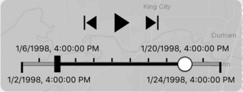
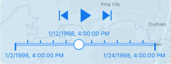

#TimeSlider

The Time Slider provides controls that allow you to visualize temporal data for time enabled layers in a map or scene.

###Features of the Time Slider


* Tap the **Play** button to play a time animation that steps through your data sequentially. Playback interval, direction and whether to repeat or reverse can be configured from the time slider properties. While playing, the **Pause** button displays in its place.
* Tap the **Forward** button to step forward to the next time stamp.
* Tap the **Back** button to step back to the previous time stamp.
* Drag the **Lower Thumb** (Current Extent Start Time) or **Upper Thumb** (Current Extent End Time) to the right or left to step through your temporal data interactively.

#### Slider Thumbs

How the Time Slider's thumbs are presented will vary depending on whether the current time extent represents a time window or instant and whether the start or end time is pinned.

* **Time Window**: If the current time extent represents a non-instantaneous duration of time, and neither the start nor end time is pinned, then two thumbs will be shown on the slider, as shown below. Both thumbs can be manipulated by end users.

  

* **Time Window - Start or End Time Pinned:** If the start or end time is pinned using the `isStartTimePinned` or `isEndTimePinned`, then the corresponding slider thumb is replaced with a bar to visually indicate that the start or end time cannot be manipulated. This allows user to cumulatively view all data from the pinned thumb until the specified position of other thumb.

  

  

* **Time Instant:** When the Time Slider's current time extent is specified as a time instant (i.e. `AGSTimeExtent.startTime` equals `AGSTimeExtent.endTime`), then one slider thumb is shown to represent the specified instant.

  

#### Labels

The labels are shown on slider to help user understand the time filtering options slider offers. 

* **Full Extent Labels:** Use `fullExtentLabelsVisible` to control the visibility of full extent labels.

* **Current Extent Labels:** Use `LabelMode.thumbs`to display the labels for the current extent start and end time.

  

* **Time Step Interval Labels:** Use `LabelMode.ticks` to display the labels for the time step intervals instead of for the current time extent.

  

#### Display Components

User can control whether to show `Slider` and/or `Playback Buttons` using `isSliderVisible` and `playbackButtonsVisible`.


### Usage

Initialize TimeSlider and add constraints to position it.

```swift
    // Configure time slider
    let timeSlider = TimeSlider()
    timeSlider.labelMode = .ticks
    timeSlider.addTarget(self, action: #selector(TimeSliderExample.timeSliderValueChanged(timeSlider:)), for: .valueChanged)
    view.addSubview(timeSlider)

    // Add constraints to position the slider
    let margin: CGFloat = 10.0
    timeSlider.translatesAutoresizingMaskIntoConstraints = false
    timeSlider.bottomAnchor.constraint(equalTo: mapView.attributionTopAnchor, constant: -margin).isActive = true

    if #available(iOS 11.0, *) {
        timeSlider.leadingAnchor.constraint(equalTo: view.safeAreaLayoutGuide.leadingAnchor, constant: margin).isActive = true
        timeSlider.trailingAnchor.constraint(equalTo: view.safeAreaLayoutGuide.trailingAnchor, constant: -margin).isActive = true
    }
    else {
        timeSlider.leadingAnchor.constraint(equalTo: view.leadingAnchor, constant: margin).isActive = true
        timeSlider.trailingAnchor.constraint(equalTo: view.trailingAnchor, constant: -margin).isActive = true
    }
```

Use one of three initialize helper function to setup properties of the Time Slider.

```swift
    public func initializeTimeProperties(geoView: AGSGeoView, observeGeoView: Bool, completion: @escaping (Error?)->Void)
    public func initializeTimeProperties(timeAwareLayer: AGSTimeAware, completion: @escaping (Error?)->Void)
    public func initializeTimeSteps(timeStepCount: Int, fullExtent: AGSTimeExtent, completion: @escaping (Error?)->Void)
```

To see it in action, try out the [Examples](../../Examples) and refer to [TimeSliderExample.swift](../../Examples/ArcGISToolkitExamples/TimeSliderExample.swift) in the project.

### Themes

| Theme                 | Example                                       |
|:-----------:           |:------:                                       |
|`Black`                 |                       |
|`Blue`                   |   |
|`Ocean Blue`      |	                        |

### Customization

You can customize many visual elements of the TimeSlider such as - 

* `currentExtentFillColor`
* `currentExtentLabelColor`
* `currentExtentLabelFont`
* `currentExtentLabelDateStyle`
* `fullExtentBorderColor`
* `fullExtentBorderWidth`
* `fullExtentFillColor`
* `fullExtentLabelColor`
* `fullExtentLabelFont`
* `fullExtentLabelDateStyle`
* `timeStepIntervalLabelDateStyle`
* `timeStepIntervalLabelColor`
* `timeStepIntervalLabelFont`
* `timeStepIntervalTickColor`
* `thumbFillColor`
* `thumbBorderColor`
* `thumbBorderWidth`
* `thumbSize`
* `thumbCornerRadius`
* `playbackButtonsFillColor`
* `layerExtentFillColor`
* `trackHeight`
* `theme`


